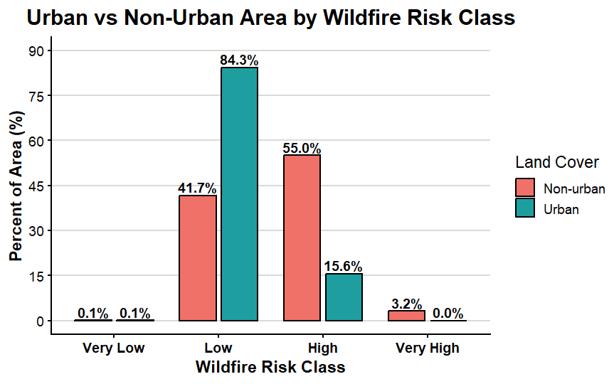
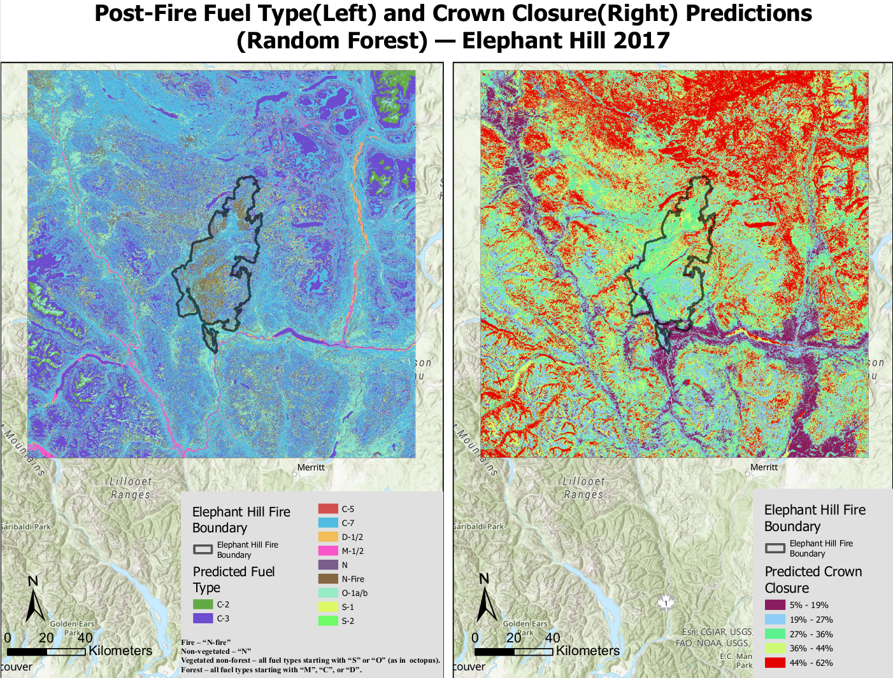

This page highlights selected work from the Master of Geomatics for Environmental Management program, with a focus on GIS, spatial analysis, environmental risk mapping, and cartographic communication.

# Master Study Capstone Project

## Wildfire Risk Mapping and Emergency Accessibility in Kelowna and West Kelowna

### Research Question

How can spatial modeling of wildfire susceptibility and emergency response time be integrated to identify vulnerable high-risk zones in **Kelowna** and **West Kelowna**, British Columbia?

### Project Overview

This capstone project integrated a **wildfire susceptibility model** with an **emergency response time analysis** to identify **vulnerable high-risk zones in Kelowna and West Kelowna**. The workflow combined **terrain**, **vegetation**, and **climate** criteria in a multi-criteria decision analysis and then linked the final wildfire risk surface to emergency accessibility using network-based travel time analysis.

### Key Methods

-   Standardized all spatial layers to a common analysis grid in NAD 1983 BC Albers (EPSG:3005)
-   Built a wildfire susceptibility model using topography, vegetation, and climate criteria
-   Reclassified all inputs to a common ordinal risk scale
-   Produced a final weighted overlay wildfire risk map
-   Used RStudio to summarize area proportions and compare urban versus non-urban exposure
-   Applied ArcGIS Pro Closest Facility analysis to identify high-risk areas with delayed emergency response

## Final Wildfire Susceptibility Map

The integrated wildfire susceptibility model produced a **four-level risk** map for Kelowna and West Kelowna. Low-risk areas were concentrated in valley bottoms and areas with less fuel supply and gentle terrain. High and very high risk areas formed patch-like and corridor-like patterns along forested slopes and the wildland–urban interface, especially around the west side of Okanagan Lake and nearby developed areas.

{fig-alt="Final wildfire susceptibility map" width="85%"}

## Area Proportion by Wildfire Risk Class

The area summary shows that the study area is dominated by **low-risk land (58.9%)** and **high-risk land (39.1%)**, while **very high risk (1.9%)** and **very low risk (0.1%)** occupy relatively small proportions. This indicates that although the most extreme susceptibility is spatially limited, a substantial share of the landscape still falls within elevated wildfire risk classes.

{fig-alt="Area proportion by wildfire risk class" width="70%"}

## Urban vs. Non-Urban Exposure

Urban and non-urban areas show different wildfire exposure patterns. Within urban land, most of the area falls into the low-risk class (84.3%), with 15.6% in the high-risk class and no very high risk identified. In contrast, non-urban land shows much greater exposure, with 55.0% in the high-risk class and 3.2% in the very high risk class. This pattern suggests that the greatest modeled wildfire vulnerability is concentrated outside core urban areas, especially around the wildland–urban interface.

{fig-alt="Urban versus non-urban wildfire risk comparison" width="75%"}

## Wildfire Risk with Response Time

To extend the hazard analysis, wildfire susceptibility was integrated with emergency accessibility. High-risk and very high-risk grid-cell centroids were analyzed using Closest Facility network analysis, with fire stations defined as facilities and driving time used as the impedance metric. Areas requiring more than 4 minutes of driving time were classified as delayed-response zones. Among 4,435 high-risk grid cells, 1,705 cells (38.4%) exceeded the 4-minute threshold, indicating that a substantial number of high-risk locations may face limited emergency access.

.png){fig-alt="Final wildfire risk map with emergency response time" width="85%"}

## Tools and Skills Demonstrated

-   ArcGIS Pro
-   Network Analyst
-   Weighted overlay analysis
-   Raster reclassification
-   RStudio
-   Spatial statistics and visualization
-   Environmental risk assessment
-   Cartographic communication

## Reflection

This project strengthened my ability to integrate multiple environmental criteria into a structured GIS workflow and connect hazard mapping with practical planning concerns such as emergency accessibility. It also improved my skills in presenting technical results through maps, charts, and spatial interpretation.

## Advanced Geographic Information Systems for Environmental Management

### Post-Fire Fuel Type and Crown Closure Prediction

It focused on predicting post-fire **fuel type** and **crown closure** for the Elephant Hill 2017 fire area using GIS and machine learning methods. The project evaluated how remote sensing, terrain, and climate variables could support post-fire vegetation mapping and model performance assessment.

### Project overview

The analysis used predictive modelling to estimate post-fire fuel type classes and crown closure patterns across the Elephant Hill Fire boundary. Different model settings and sampling strategies were compared to evaluate classification and regression performance. The final map below shows the **Random Forest** prediction outputs for both variables.

{fig-alt="Post-fire fuel type and crown closure predictions for Elephant Hill 2017" width="90%"}

### Key findings

The study identified **14 fuel types** in the VRI-based dataset. Spatial autocorrelation analysis showed that crown closure was strongly clustered across the landscape, with a **Moran’s I value of 0.265262**, indicating that nearby areas tended to have similar crown closure values.

Among the tested models, the best-performing fuel type model was **random_output_FT**, with a validation accuracy of **0.41**. The best-performing crown closure model was **control_output_CC**, with a validation **R² of 0.526**. The strongest exploratory regression model included **DEM, Aspect, SHM, TCB, and TCW**, suggesting that terrain, moisture, and spectral structure variables were important predictors of post-fire vegetation conditions.

### Top Three Exploratory Regression Models

The three strongest exploratory regression models produced the same **R² value (0.33)**, with very similar **AIC** values and low **VIF** values, indicating limited multicollinearity. All predictors in the selected models were statistically significant at **p ≤ 0.01**.

| Rank | Model variables | R² | AIC | VIF | Significance |
|:----------:|------------|:----------:|-----------:|:----------:|------------|
| 1 | `-DEM*** -ASPECT*** -SHM*** -TCB*** +TCW***` | 0.33 | 693122.43 | 1.75 | All predictors significant (p ≤ 0.01) |
| 2 | `-DEM*** +SLOPE*** -SHM*** -TCB*** +TCW***` | 0.33 | 693122.99 | 1.75 | All predictors significant (p ≤ 0.01) |
| 3 | `+SLOPE*** +MAT*** -SHM*** -TCB*** +TCW***` | 0.33 | 693122.18 | 3.42 | All predictors significant (p ≤ 0.01) |

These models consistently highlighted terrain, moisture, and spectral variables as important predictors, especially **DEM**, **slope**, **SHM**, **TCB**, and **TCW**.

### Interpretation

The prediction results suggest that crown closure can be modelled more effectively than fuel type because it is more directly related to continuous canopy structure and environmental gradients. In contrast, fuel type prediction was more difficult because some vegetation classes were spectrally similar and some rare classes were harder to represent consistently across the training data. Overall, it demonstrated how remote sensing variables, terrain factors, and statistical modelling can be combined in GIS to support post-fire landscape analysis.

### Skills demonstrated

-   ArcGIS Pro
-   Random Forest modelling
-   exploratory regression
-   spatial autocorrelation analysis
-   remote sensing interpretation
-   post-fire vegetation mapping
-   model comparison and validation

### Reflection

This project improved my understanding of how sampling design, predictor selection, and model choice influence spatial prediction results. It also strengthened my ability to interpret both categorical and continuous outputs within a GIS-based environmental modelling workflow.
